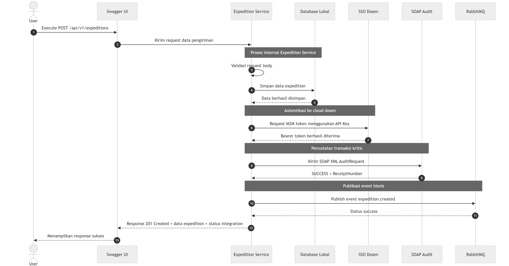

# Analisis Tugas 3 - Expedition Service

## Identitas

| Keterangan | Detail                  |
| ---------- | ----------------------- |
| Nama       | Meilisya Nabila Siregar |
| NIM        | 102022400313            |
| Service    | Expedition Service      |
| Team       | TEAM-03                 |

---

## 1. Transaksi Kritis

Transaksi kritis pada **Expedition Service** adalah proses pembuatan data pengiriman melalui endpoint:

```http
POST /api/v1/expeditions
```

Transaksi ini dipilih karena proses pembuatan data pengiriman terjadi setelah order diproses dan barang dinyatakan lolos Quality Control oleh Inventory Service. Pada tahap ini, sistem mencatat data penting seperti order ID, nama customer, alamat tujuan, nama kurir, nomor resi, dan status pengiriman.

Transaksi ini termasuk transaksi penting karena bersifat **state-changing**, yaitu mengubah proses fulfillment dari tahap barang siap dikirim menjadi tahap pengiriman diproses. Oleh karena itu, aktivitas ini perlu dicatat ke sistem audit dan dipublikasikan sebagai event agar dapat diketahui oleh sistem lain.

---

## 2. Justifikasi Transaksi Kritis

Transaksi pembuatan data pengiriman dinilai kritis karena:

1. Berhubungan langsung dengan proses akhir fulfillment.
2. Menjadi dasar pengiriman barang kepada customer.
3. Membutuhkan data order dan hasil Quality Control yang valid.
4. Menghasilkan informasi penting seperti nomor resi dan status pengiriman.
5. Perlu dicatat ke sistem audit agar aktivitas pengiriman dapat ditelusuri.
6. Perlu dipublikasikan sebagai event agar sistem lain mengetahui bahwa proses pengiriman telah dibuat.

Berdasarkan alasan tersebut, endpoint `POST /api/v1/expeditions` dipilih sebagai transaksi utama yang diintegrasikan dengan layanan cloud dosen.

---

## 3. Integrasi dengan SSO

Expedition Service menggunakan token dari sistem SSO dosen untuk mengakses layanan cloud. Token diperoleh menggunakan API Key yang diberikan melalui LMS. Pada implementasi ini, service menggunakan **M2M token** dengan grant type:

```text
client_credentials
```

Token tersebut digunakan sebagai **Bearer Token** untuk mengakses layanan **SOAP Audit** dan **RabbitMQ Publisher**.

Konfigurasi cloud dosen disimpan pada file `.env`, kemudian dipanggil melalui `config/services.php`. Hal ini dilakukan agar informasi seperti base URL, API Key, Team ID, dan exchange tidak ditulis langsung di controller.

Contoh konfigurasi yang digunakan:

```env
IAE_CLOUD_URL=https://iae-sso.virtualfri.id
IAE_API_KEY=KEY-MHS-367
IAE_TEAM_ID=TEAM-03
IAE_EXCHANGE=iae.central.exchange
```

---

## 4. Integrasi dengan SOAP Audit

Pada transaksi `POST /api/v1/expeditions`, data pengiriman yang berhasil dibuat akan dikirim ke layanan **SOAP Audit** dosen.

Data transaksi dikirim dalam format **SOAP XML Envelope**. Informasi pengiriman dimasukkan ke dalam tag `LogContent` dalam bentuk CDATA JSON. Activity name yang digunakan adalah:

```text
ExpeditionCreated
```

Contoh isi data yang dikirim ke SOAP Audit:

```json
{
  "order_id": 11,
  "customer_name": "Meilisya Nabila",
  "customer_address": "Jl. Buah Batu No. 1, Bandung",
  "courier_name": "JNE",
  "tracking_number": "EXP-2026-021",
  "shipping_status": "processing"
}
```

Jika proses audit berhasil, sistem SOAP mengembalikan status sukses dan receipt number. Pada hasil pengujian, response SOAP Audit berhasil menghasilkan receipt number:

```text
IAE-LOG-2026-BAE17DC0
```

Hal ini menunjukkan bahwa transaksi pengiriman berhasil dicatat pada sistem audit dosen.

---

## 5. Integrasi dengan RabbitMQ

Setelah data pengiriman berhasil dibuat, Expedition Service juga mengirimkan event ke RabbitMQ melalui endpoint publish yang disediakan oleh cloud dosen.

Event yang digunakan adalah:

```text
expedition.created
```

Event ini digunakan untuk memberi tahu sistem lain bahwa data pengiriman baru telah dibuat. Payload event berisi informasi seperti team ID, service name, activity name, event name, dan data expedition.

Pada hasil pengujian melalui Swagger, RabbitMQ berhasil mengembalikan status:

```text
success
```

Artinya, event `expedition.created` berhasil dipublikasikan ke cloud dosen.

---

## 6. Alur Integrasi Sistem

Alur integrasi pada Expedition Service adalah sebagai berikut:

1. User melakukan request pembuatan data pengiriman melalui Swagger UI.
2. Swagger mengirim request ke endpoint `POST /api/v1/expeditions`.
3. Expedition Service melakukan validasi request.
4. Data expedition disimpan ke database lokal.
5. Expedition Service meminta M2M token ke SSO dosen menggunakan API Key.
6. SSO dosen mengembalikan Bearer Token.
7. Expedition Service mengirim data transaksi ke SOAP Audit dalam format XML.
8. SOAP Audit mengembalikan status sukses dan receipt number.
9. Expedition Service mempublikasikan event `expedition.created` ke RabbitMQ.
10. RabbitMQ mengembalikan status sukses.
11. Expedition Service mengembalikan response `201 Created` ke user.

---

## 7. Sequence Diagram

Berikut adalah sequence diagram transaksi kritis pada Expedition Service, mulai dari eksekusi endpoint `POST /api/v1/expeditions`, penyimpanan data ke database lokal, pengambilan token M2M ke SSO dosen, pengiriman audit ke SOAP, hingga publikasi event ke RabbitMQ.



---

## 8. Implementasi pada Laravel

Integrasi cloud dosen dibuat melalui file service:

```text
app/Services/IaeCloudService.php
```

File tersebut berisi fungsi untuk:

1. Mengambil token dari SSO dosen.
2. Mengirim data transaksi ke SOAP Audit.
3. Mempublikasikan event ke RabbitMQ.

Pada controller utama:

```text
app/Http/Controllers/Api/V1/ExpeditionController.php
```

fungsi `store()` diperbarui agar setelah data expedition berhasil dibuat, sistem otomatis menjalankan:

```php
$receiptNumber = $iaeCloud->sendSoapAudit($expedition->toArray());
$rabbitPublished = $iaeCloud->publishRabbitMq($expedition->toArray());
```

Dengan begitu, proses integrasi tidak hanya diuji secara manual, tetapi juga berjalan langsung ketika endpoint `POST /api/v1/expeditions` dieksekusi melalui Swagger UI.

---

## 9. Hasil Pengujian

Pengujian dilakukan melalui Swagger UI pada endpoint:

```http
POST /api/v1/expeditions
```

Request body yang digunakan:

```json
{
  "order_id": 11,
  "customer_name": "Meilisya Nabila",
  "customer_address": "Jl. Buah Batu No. 1, Bandung",
  "courier_name": "JNE",
  "tracking_number": "EXP-2026-021",
  "shipping_status": "processing"
}
```

Hasil pengujian menunjukkan response HTTP status code:

```text
201 Created
```

Data expedition berhasil dibuat, SOAP Audit berhasil mengembalikan receipt number, dan RabbitMQ berhasil mempublikasikan event.

Response integration:

```json
{
  "soap_audit": {
    "status": "success",
    "receipt_number": "IAE-LOG-2026-BAE17DC0"
  },
  "rabbitmq": {
    "status": "success",
    "event": "expedition.created"
  }
}
```

---

## 10. Evidence

Evidence hasil pengujian disimpan pada folder:

```text
evidence-tugas-3/
```

Daftar evidence:

```text
1-sso-token.jpeg
2-soap-audit.jpeg
3-rabbitmq-publish.jpeg
4-swagger-post-integrated.jpeg
5-dashboard-event.jpeg
6-sequence-diagram.png
```

Keterangan evidence:

| File                             | Keterangan                                                                               |
| -------------------------------- | ---------------------------------------------------------------------------------------- |
| `1-sso-token.png`               | Bukti pengambilan M2M token dari SSO dosen                                               |
| `2-soap-audit.png`              | Bukti SOAP Audit berhasil mengembalikan status sukses dan receipt number                 |
| `3-rabbitmq-publish.png`        | Bukti event berhasil dipublish ke RabbitMQ                                               |
| `4-swagger-post-integrated.png` | Bukti endpoint `POST /api/v1/expeditions` berhasil menjalankan integrasi melalui Swagger |
| `5-dashboard-event.png` | Bukti event dari TEAM-03 muncul pada dashboard/board RabbitMQ dosen |
| `6-sequence-diagram.png` | Gambar sequence diagram transaksi kritis Expedition Service |

---

## 11. Kesimpulan

Expedition Service berhasil diintegrasikan dengan cloud dosen melalui SSO, SOAP Audit, dan RabbitMQ. Transaksi kritis yang digunakan adalah pembuatan data pengiriman melalui endpoint:

```http
POST /api/v1/expeditions
```

Ketika endpoint tersebut dieksekusi melalui Swagger UI, service berhasil menyimpan data expedition ke database lokal, mencatat aktivitas ke SOAP Audit, dan mempublikasikan event `expedition.created` ke RabbitMQ.

Dengan demikian, Expedition Service telah memenuhi kebutuhan integrasi pada Tugas 3, yaitu terhubung dengan sistem SSO, melakukan pencatatan transaksi kritis melalui SOAP Audit, dan mengirim event bisnis melalui RabbitMQ.
