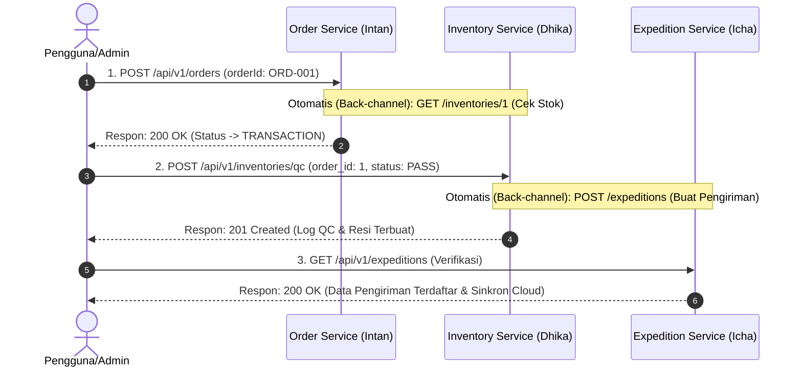

# PANDUAN UJI COBA INTEGRASI END-TO-END (E2E) & SWAGGER UI
### Tugas Besar Integrasi Aplikasi Perusahaan (IAE) - Semester 4
**Kelompok Integrasi Layanan (Order, Inventory, & Expedition)**

---

## 📌 DAFTAR ISI
1. [Arsitektur Jaringan & URL Dokumentasi Swagger](#1-arsitektur-jaringan--url-dokumentasi-swagger)
2. [Skenario Pengujian Alur Proses Bisnis Gabungan (Fulfillment)](#2-skenario-pengujian-alur-proses-bisnis-gabungan-fulfillment)
   - [Langkah 1: Pemrosesan Transaksi (Order Service)](#langkah-1-pemrosesan-transaksi-order-service)
   - [Langkah 2: Pencatatan Hasil QC (Inventory Service)](#langkah-2-pencatatan-hasil-qc-inventory-service)
   - [Langkah 3: Verifikasi Pengiriman & Cloud Compliance (Expedition Service)](#langkah-3-verifikasi-pengiriman--cloud-compliance-expedition-service)
3. [Mengapa Pengujian Tidak Dilakukan Secara Manual?](#3-mengapa-pengujian-tidak-dilakukan-secara-manual)
   - [A. Pemenuhan Rubrik Penilaian E2E (Bobot 25%)](#a-pemenuhan-rubrik-penilaian-e2e-bobot-25)
   - [B. Konsistensi Data & Pencegahan Human Error](#b-konsistensi-data--pencegahan-human-error)
   - [C. Batasan Hak Akses & Keamanan Jaringan Internal](#c-batasan-hak-akses--keamanan-jaringan-internal)
4. [Perintah Bermanfaat untuk Troubleshooting (Cheat Sheet)](#4-perintah-bermanfaat-untuk-troubleshooting-cheat-sheet)

---

## 1. ARSITEKTUR JARINGAN & URL DOKUMENTASI SWAGGER

Seluruh microservice berjalan di dalam satu jaringan virtual Docker (**`fulfillment-network`**) dan dibungkus di belakang **Nginx API Gateway**. 

Untuk mempermudah pengujian langsung melalui browser, port internal masing-masing container telah dipetakan (expose) ke mesin host lokal Anda:

| Nama Service | URL Akses API (Gateway) | URL Dokumentasi Swagger UI | API Key Pengaman (`X-IAE-KEY`) |
| :--- | :--- | :--- | :--- |
| **API Gateway** | `http://localhost:8000` | - | - |
| **Order Service** (Intan) | `http://localhost:8000/api/v1/orders` | `http://localhost:3000/api/documentation` | Token JWT SSO Dosen |
| **Inventory Service** (Dhika) | `http://localhost:8000/api/v1/inventories` | `http://localhost:8081/api/documentation` | `102022400047` |
| **Expedition Service** (Icha) | `http://localhost:8000/api/v1/expeditions` | `http://localhost:8082/api/documentation` | `102022400313` |

---

## 2. SKENARIO PENGUJIAN ALUR PROSES BISNIS GABUNGAN (FULFILLMENT)

Skenario ini mendemonstrasikan proses pemenuhan barang dari pesanan pembeli hingga kurir terdaftar otomatis di ekspedisi.



### **LANGKAH 1: Pemrosesan Transaksi (Order Service)**
*   **Tujuan:** Customer memproses transaksi order `ORD-001`. Sistem akan mengecek ketersediaan stok barang Buku Pemrograman ke database gudang Dhika secara otomatis sebelum mengubah status pesanan.
*   **Langkah Eksekusi:**
    1. Buka browser, masuk ke **Swagger UI Order Service** (`http://localhost:3000/api/documentation`).
    2. Klik tombol **Authorize** di kanan atas. Masukkan Token JWT SSO Dosen terupdate ke dalam kolom **BearerAuth**, lalu klik **Authorize** -> **Close**.
    3. Pilih endpoint **`POST /api/v1/orders`**.
    4. Klik **Try it out**.
    5. Masukkan JSON payload berikut pada kolom Request Body:
       ```json
       {
         "orderId": "ORD-001"
       }
       ```
    6. Klik **Execute**.
*   **Apa yang Terjadi di Balik Layar (Otomatis):**
    *   Order Service menerima request dan mencari detail barang untuk order `ORD-001` (yaitu barang ID `1` sebanyak `2` buah).
    *   Secara otomatis di belakang layar, program mengirim request HTTP GET ke Inventory Service Dhika di: `http://inventory-service:80/api/v1/inventories/1`.
    *   Jika stok di database Dhika mencukupi (stok = 100), transaksi disetujui.
*   **Hasil yang Diharapkan (Response):**
    *   HTTP Status Code: **`200 OK`**
    *   Respon JSON menampilkan status order berubah menjadi **`TRANSACTION`**.

---

### **LANGKAH 2: Pencatatan Hasil QC (Inventory Service)**
*   **Tujuan:** Pihak gudang memproses data order yang telah bertransaksi dan mencatat hasil pemeriksaan Quality Control (QC). Jika barang lolos QC (PASS), sistem gudang otomatis memesan kurir ekspedisi.
*   **Langkah Eksekusi:**
    1. Buka browser, masuk ke **Swagger UI Inventory Service** (`http://localhost:8081/api/documentation`).
    2. Klik tombol **Authorize** di kanan atas. Masukkan API Key **`102022400047`** (NIM Dhika) pada kolom **ApiKeyAuth**, lalu klik **Authorize** -> **Close**.
    3. Pilih endpoint **`POST /api/v1/inventories/qc`**.
    4. Klik **Try it out**.
    5. Masukkan JSON payload berikut pada kolom Request Body:
       ```json
       {
         "order_id": 1,
         "qc_status": "PASS",
         "notes": "Barang mulus lulus QC, kondisi prima"
       }
       ```
    6. Klik **Execute**.
*   **Apa yang Terjadi di Balik Layar (Otomatis):**
    *   Sistem Dhika memproses status QC menjadi `PASS`.
    *   Karena statusnya lolos, sistem Dhika secara otomatis mengirim HTTP POST request ke Expedition Service milik Icha di: `http://expedition-service:8000/api/v1/expeditions`.
    *   Request tersebut mengirim data order, nama penerima, alamat tujuan, serta men-generate kode nomor resi pelacakan secara otomatis (`TRK-IAE-XXXX`).
*   **Hasil yang Diharapkan (Response):**
    *   HTTP Status Code: **`201 Created`**
    *   Respon JSON menampilkan data sukses QC gudang, sekaligus key **`expedition`** yang melampirkan detail kurir yang telah sukses dibuat otomatis.

---

### **LANGKAH 3: Verifikasi Pengiriman & Cloud Compliance (Expedition Service)**
*   **Tujuan:** Memastikan data pengiriman kurir telah terdaftar dengan benar di database ekspedisi dan memverifikasi integrasi 3 lapis cloud dosen (SSO Login -> SOAP Audit -> RabbitMQ Publish) berjalan sukses.
*   **Langkah Eksekusi:**
    1. Buka browser, masuk ke **Swagger UI Expedition Service** (`http://localhost:8082/api/documentation`).
    2. Klik tombol **Authorize** di kanan atas. Masukkan API Key **`102022400313`** (NIM Icha) pada kolom **ApiKeyAuth**, lalu klik **Authorize** -> **Close**.
    3. Pilih endpoint **`GET /api/v1/expeditions`**.
    4. Klik **Try it out** -> **Execute**.
*   **Hasil yang Diharapkan (Response):**
    *   HTTP Status Code: **`200 OK`**
    *   Menampilkan data kurir pengantaran untuk `order_id: 1` yang dibuat otomatis di Langkah 2.
    *   Menampilkan status **`soap_audit: success`** (berisi nomor Receipt unik dari SOAP Dosen) dan status **`rabbitmq: success`** (routing key `expedition.created` sukses dikirim).

---

## 3. MENGAPA PENGUJIAN TIDAK DILAKUKAN SECARA MANUAL?

Berikut adalah alasan teknis dan akademis mengapa pengguna tidak diperbolehkan memanggil seluruh endpoint (seperti cek stok dan pembuatan kurir) secara manual:

### **A. Pemenuhan Rubrik Penilaian E2E (Bobot 25%)**
Berdasarkan rubrik penilaian Tugas Besar IAE, komponen **End-to-End Core Business Flow** mensyaratkan:
> *"Alur transaksi berjalan mulus lintas service (Service A memanggil Service B secara internal via REST/GraphQL untuk menyelesaikan skenario bisnis tanpa intervensi manual)"*
Jika admin atau pembeli harus menembak API secara manual satu per satu lewat Swagger/Postman, maka kriteria integrasi otomatis ini dinyatakan **gagal** dan kelompok kehilangan 25% nilai.

### **B. Konsistensi Data & Pencegahan Human Error**
Apabila data pengiriman (nama pembeli, alamat, nomor resi, dll) diinput secara manual oleh admin ekspedisi:
*   Risiko terjadinya kesalahan pengetikan alamat atau nomor order (*human error*) sangat tinggi.
*   Dengan sistem terintegrasi, data pengiriman dikirim langsung secara terprogram dari database gudang ke database ekspedisi, menjamin data **100% konsisten**.

### **C. Batasan Hak Akses & Keamanan Jaringan Internal**
*   **Customer** hanya boleh memiliki hak akses ke *Order Service*. Customer tidak boleh memiliki akses langsung untuk mengutak-atik database gudang (*Inventory*) maupun data kurir (*Expedition*).
*   Komunikasi antarlayanan dilakukan di tingkat belakang layar (*back-channel*) menggunakan isolasi jaringan internal Docker (`fulfillment-network`) untuk menjaga keamanan sistem dari luar.

---

## 4. PERINTAH BERMANFAAT UNTUK TROUBLESHOOTING (CHEAT SHEET)

Jika di tengah jalan kamu menemukan error, gunakan perintah-perintah CMD/PowerShell berikut di root directory untuk memulihkan sistem secara cepat:

*   **Pembersihan Cache & Reset State Awal Order:**
    *   Buka browser dan akses: `http://localhost:3000/api/v1/reset`
    *   *Perintah ini akan membersihkan cache order dan mereset statusnya kembali menjadi PENDING.*

*   **Menjalankan Ulang Migrasi Database Fresh (Reset Data):**
    ```powershell
    # 1. Reset & Seed Database Order
    docker exec order-service php artisan migrate:fresh --seed --force

    # 2. Reset & Seed Database Inventory
    docker exec inventory-service php artisan migrate:fresh --seed --force

    # 3. Reset & Seed Database Expedition
    docker exec expedition-service php artisan migrate:fresh --seed --force
    ```

*   **Membersihkan Cache Konfigurasi Container:**
    ```powershell
    docker exec order-service php artisan config:clear
    docker exec inventory-service php artisan config:clear
    docker exec expedition-service php artisan config:clear
    ```
